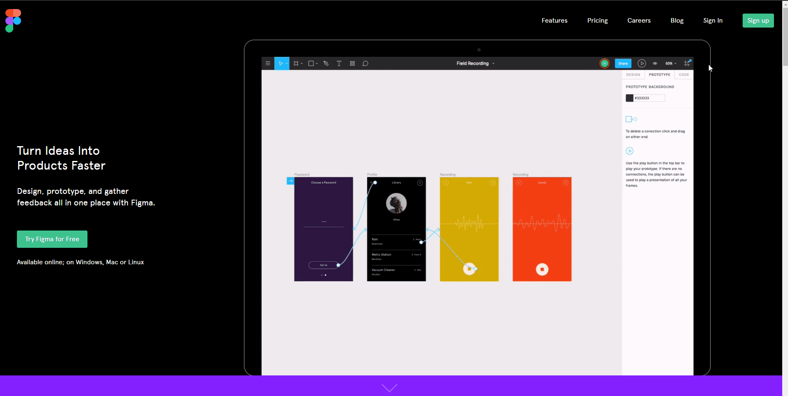

## 1. Create an account on [Figma.com](https://www.figma.com)

## 2. Login to your figma account

## 3. Download BOTMOCK UI KIT: [Here](http://botmoc.budnick.io/botmoc.fig)

## 4. Drag and drop the file to import into your figma account.

