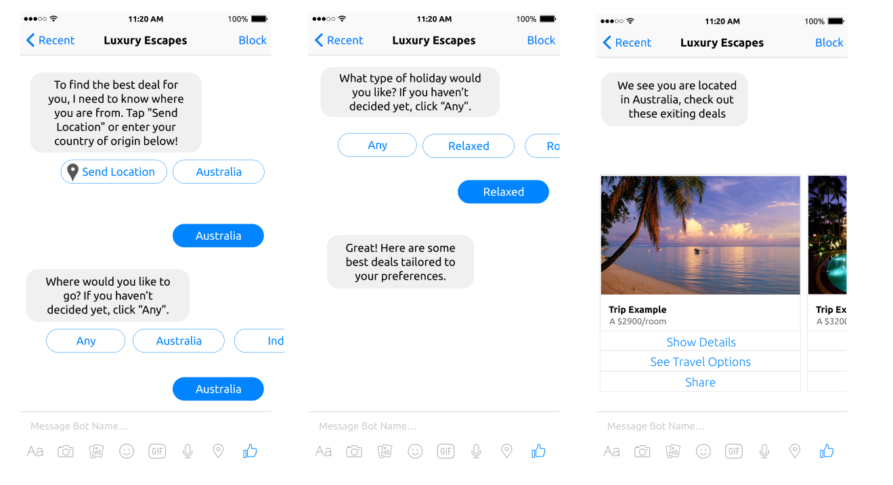
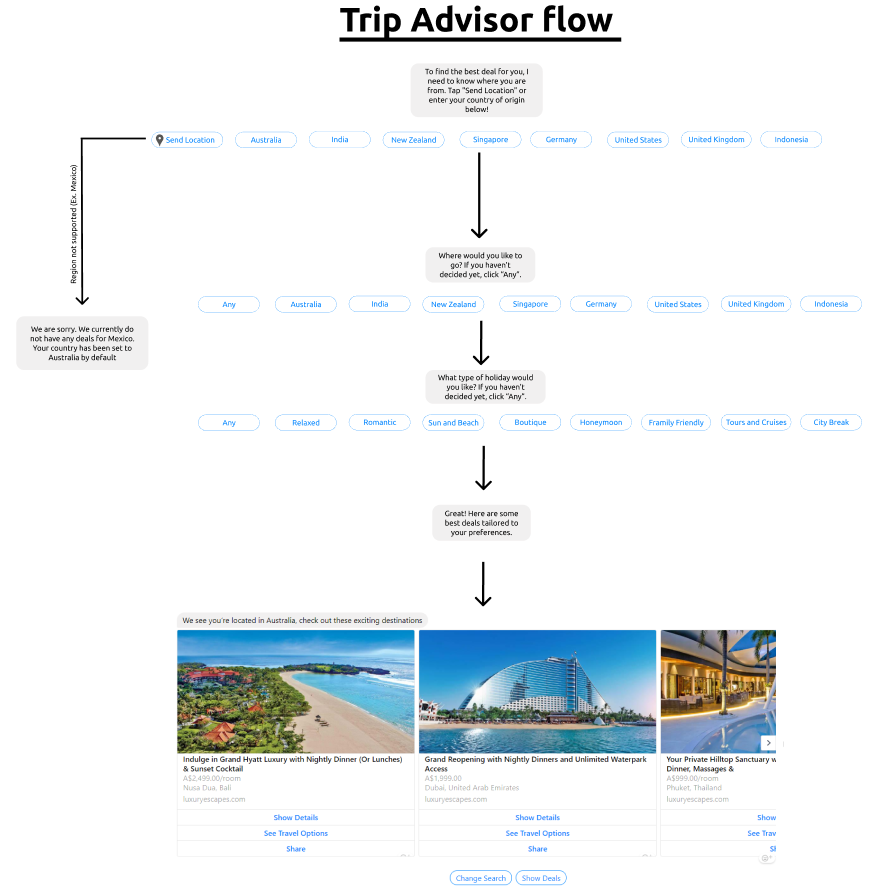

## Phone Mockups

#### Phone mockups are used for desinging a bot flow the resembles smartphone screenshots. You can use muliple of these phone sceen mock ups to design a full bot flow.

## Bot Flows

#### Bot flows are used for desiging bot flows with multiple paths. Using the facebook elements make it easy for a client to see what I will look like in facebook.

